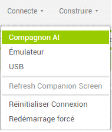

<!-- Visiblement il serait possible de piloter une BBC micro:bit depuis une telle application : 
-	https://iot.appinventor.mit.edu/assets/howtos/MIT_App_Inventor_Microbit_LED.pdf
-	https://community.appinventor.mit.edu/t/app-inventor-micro-bit-and-uart/44876

Mais il s’agit là d’une connexion Bluetooth donc, a priori, pas de programmation possible en micropython sur BBC micro:bit V1, ni V2 pour l’instant : https://microbit-micropython.readthedocs.io/en/v2-docs/ble.html

En revanche cela semble possible sur ESP32  (https://www.youtube.com/watch?v=VGEd6ZFzF04), ou encore sur Rasberry PI, à tester donc…

Cependant il s’agit là souvent de communication Bluetooth or ils viennent de faire un TP sur réseau LAN Ethernet et Wifi : https://nbviewer.org/urls/ericecmorlaix.github.io/TSI-NSI_2023-2024/CR/Network-Un_BN_pour_la_communication_en_reseau.ipynb
Il s’agirait donc de rechercher des solutions facilement applicables dans cette direction… -->

App Inventor pour Android est une application initialement fournie par Google et maintenant gérée par le MIT, Massachusetts Institute of Technology. Il permet à toute personne, y compris aux personnes peu familiarisées avec la programmation informatique, de créer des applications logicielles pour le système d'exploitation Android. Il utilise une interface graphique, très similaire à Scratch. 

### MIT App Inventor sans compte Gmail  :

<!-- source = <http://edulab82.fr/wp_pa82/index.php/app-inventor-sans-codes/>  ou <https://www.youtube.com/watch?v=OuODQeYjYBc> -->
<!-- code test LOAM-ACHE-TWIT-CHOW -->

- **Se connecter** en utilisant le lien <https://code.appinventor.mit.edu/login/?locale=fr_FR>{target=_blank}
    - **Cliquer** sur le bouton `Continue Without An Account` ;
    - Bien **noter** le code à quatre mots qui est généré, c'est celui qui vous permettra de retrouver votre travail lorsque vous revisiterez ce site ;
    - **Cliquer** sur le bouton `Continue` ;
    - **Cocher** la case `Do Not Show Again` puis **Cliquer** sur le bouton `Continue` ;
    - **Cliquer** sur le bouton `Close` ;
    > Vous êtes alors connecté en tant qu'anonyme...
- **Se déconnecter** (*C'est impératif pour protéger votre travail*)
    - **Cliquer** sur le bouton du menu horizontal en haut tout à droite `anon-#############` ;
    - **Choisir** `Sign out` ;
    > == /!\ **ne pas choisir** `Delete Account`, vous perdriez tout votre travail !!!==

### Connecter votre iPad :

> Cela permet de tester votre application en direct sur l'iPad lors de son développement. Mais il ne sera pas possible de l'installer sur IOS, pour encore, et il faudra utiliser un appareil Androïd pour cela...

- Depuis la bibliothèque `Elèves` **installer** l'application `MIT App Inventor` ;
- **Connecter** sur le même réseau LAN votre PC (Ethernet) et votre iPad (Wifi) ;
- Sur le PC dans le menu de MIT App Inventor, **créer** un nouveau projet ou **ouvrir** un projet existant puis **cliquer** sur `Connecte` et **choisir** `Compagnon AI`;

{.center}

- Sur votre iPad depuis l'application Mit App Inventor, **scanner** le  QR code ou **saisir** le code à 6 caractères ;

> Source : <https://appinventor.mit.edu/explore/ai2/setup-device-wifi.html>{target=_blank}

??? tip "Tout faire directement sur l'iPad"
    
    

    <iframe width="560" height="315" src="https://www.youtube-nocookie.com/embed/u0ry5xwtR9Q?si=4lIiHvyQ_fDFtUPM" title="YouTube video player" frameborder="0" allow="accelerometer; autoplay; clipboard-write; encrypted-media; gyroscope; picture-in-picture; web-share" allowfullscreen></iframe>
    

### Une première application

- <https://appinventor.mit.edu/explore/ai2/hellopurr>

- <https://fr.vittascience.com/learn/tutorial.php?id=58/Construire-votre-premi%C3%A8re-application-%22Bonjour-Vittascience-!%22>

??? example "HOUR OF CODE : Talk to me"

    

    <iframe width="560" height="315" src="https://www.youtube-nocookie.com/embed/Vdo8UdkgDD8?si=rqMUzMHxxY_h5VgD" title="YouTube video player" frameborder="0" allow="accelerometer; autoplay; clipboard-write; encrypted-media; gyroscope; picture-in-picture; web-share" allowfullscreen></iframe>
    

    

    <iframe width="560" height="315" src="https://www.youtube-nocookie.com/embed/0hikoCvM3oc?si=RtwlxhAuigRaYuri" title="YouTube video player" frameborder="0" allow="accelerometer; autoplay; clipboard-write; encrypted-media; gyroscope; picture-in-picture; web-share" allowfullscreen></iframe>
    

??? example "TIC TAC TOE"

    

    <iframe width="560" height="315" src="https://www.youtube.com/embed/NSFLhnv2pQI?si=mfRBLtAiOXt2a93R" title="YouTube video player" frameborder="0" allow="accelerometer; autoplay; clipboard-write; encrypted-media; gyroscope; picture-in-picture; web-share" allowfullscreen></iframe>
    

??? example "LIVE LOCATION TRACKER"

    

    <iframe width="560" height="315" src="https://www.youtube-nocookie.com/embed/HFlASeTVJLE?si=SYh_ZVO-JdaqP57W" title="YouTube video player" frameborder="0" allow="accelerometer; autoplay; clipboard-write; encrypted-media; gyroscope; picture-in-picture; web-share" allowfullscreen></iframe>
    

A tester :

- <https://iot.appinventor.mit.edu/assets/howtos/MIT_App_Inventor_Microbit_LED.pdf>
- <https://www.youtube.com/watch?v=RNtjyCC1En4>
- <https://perennesphilippe.pagesperso-orange.fr/Files/Other/dossier%20systeme%20embarque%20ou%20connecte.pdf>

- <https://community.appinventor.mit.edu/t/esp32-wifi-webserver-led-on-off-static-ip-soft-access-point/9323/3>
- <https://www.youtube.com/watch?v=RG0ZYlRdnLw>
- <https://www.youtube.com/watch?v=pAsQ8zZCcHo>

- <https://pedagogie.ac-toulouse.fr/sii/sites/sii.disciplines.ac-toulouse.fr/files/ressources/didacticiels/programmation/objets-connectes/app-inventor/15-appinventor-appafficher_serveur.pdf>

- <https://onvaessayer.org/vaucanson/41-appinventorIntro/1-PresAppInventor.php>
- <http://kio4.com/appinventorf/index.htm>
- Androïd ? BBC : <https://tribu.phm.education.gouv.fr/toutatice-portail-cms-nuxeo/binary/Connexion+avec+MicroBit.pdf?type=FILE&path=%2Fdefault-domain%2Fworkspaces%2Fressources-snt-jbs%2Fdocuments%2F8-les-objets-connectes%2F3-activites-branchees%2F3-developpes-ton-ihm%2Fconnexion-avec-microbit.1585846146003&portalName=foad&liveState=true&fieldName=file:content&t=1590016418>
- Androïd ? BBC + HC05 <https://fr.vittascience.com/learn/tutorial.php?id=59/compteur-de-pas-bluetooth-avec-micro:bit>
- Androïd ? Arduino + HC05 <https://www.youtube.com/watch?v=aQcJ4uHdQEA>
- Androïd ? BBC V2 : https://appinventor.mit.edu/explore/ai2/IoT_unit

Alternatives : <https://fr.altapps.net/soft/app-inventor-for-android?platform=iphone>

