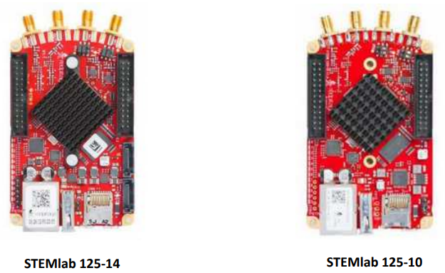
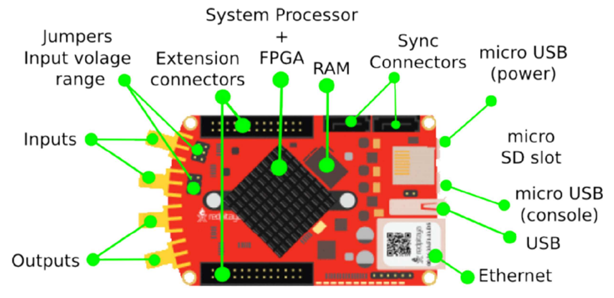
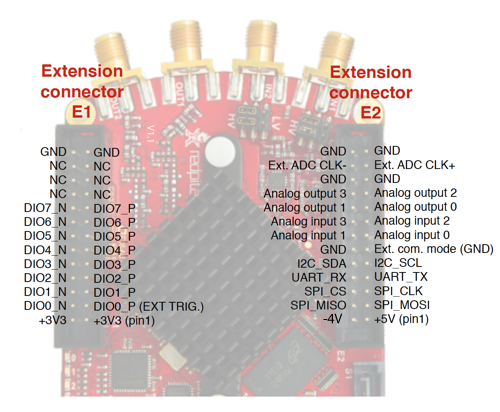
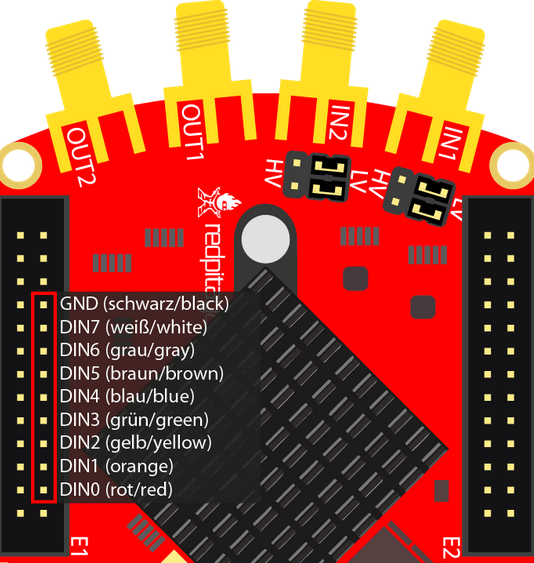

# RedPitaya

[{.center width=15%}](https://redpitaya.com/){target=_blank}

{.center width=70%}

Ces cartes se présentent comme les couteaux Suisse du test, de la mesure et du contrôle de signaux rapides. Elles permettent de remplacer de nombreux instruments de laboratoire onéreux et tout ceci de manière très simple grâce à une bibliothèque d’applications open source en ligne.

Les RedPitaya sont des cartes de développement comme Arduino ou Raspberry Pi, où les possibilités sont infinies. La particularité de celles-ci est la capacité de gérer des signaux rapides jusqu’à 50Mhz.

## Architecture des STEMlab

{.center width=70%}

???- abstract ""
    La carte est basée sur un système sur puce SOC — FPGA de la gamme Xilinx Zynq qui permet de combiner la capacité de programmation d’un cœur ARM Cortex-A9 à double cœur (LINUX embarqué) et les capacités matérielles d’un FPGA permettent de fournir un système d’une performance inégalée.
    
    L’instrument est équipé de deux entrées et deux sorties analogiques RF (125 MS/s). Différentes résolutions sont proposés (10,14 ou 16 bits), quatre entrées et quatre sorties analogiques (100 kS/s), ainsi que de 16 ports entrés/sorties logiques universels. Coté connectivité, nous pouvons compter sur un port ETHERNET 1 Gbit, un port USB 2.0 et autre protocoles (I2C, SPI, UART), le tout peut être autonome grâce à la carte SD.
    
    Pour le soft la carte est basée sur le système d’exploitation GNU/Linux. elle peut être programmée avec différents niveaux avec une variété d’interfaces logicielles, les langages de programmation sont : HDL/Verilog, C/C++, Python/Jupyter, et un serveur web intégré (NGINX) pour des interfaces web basées sur HTML/JavaScript.

## Spécifications des STEMlab 125-10 vs 125-14

- La STEMlab 125-14 (à l'origine la redpitaya V1.1) a un CAN de résolution 14bits et possède deux ports microUSB : ==l'alimentation 5V-2A(minimum) se branche sur celui le plus à l'extérieur==.
{.center width=50%}  
Pour que l'analyseur logique fonctionne, les signaux d'entrées doivent préalablement être inversés ([montage porte NON avec un transistor NPN par exemple](https://www.instructables.com/Comment-Cr%C3%A9er-Des-Portes-Logiques-Avec-Des-Transis/){target=_blank}) avant d'être raccordés au connecteur E1 sur `DI00_P` à `DI07_P` sans oublier le `GND`.

- La STEMlab 125-10 a un CAN de résolution 10bits et ne possède qu'un seul port microUSB pour l'alimentation 5V-2A(minimum).
{.center width=32%}  
La nappe des fils de l'analyseur logique se branche directement sur le connecteur E1 à l'endroit repéré `logic analyser` sur la carte avec le fil noir en face de la marque `GND`.
 

???- abstract ""

    
<iframe src="./STEMLab_125-14_vs_10_specifications.pdf#toolbar=0" width="90%" height="500px"> </iframe>

## Mise en route

- **Alimenter** un routeur du labo ;
- **Raccorder** le câble ethernet de la RedPitaya au switch de ce routeur ;
- **Alimenter** la RedPitaya sous 5V-2A(minimum) ;
> Au bout du démarrage, les LEDs bleu et verte sont allumées et la rouge clignote, alors, la RedPitaya a normalement obtenu l'IP `192.168.n.100` avec `n` le numéro du routeur ;
- **Connecter** alors un PC au LAN et/ou votre iPad au WLAN de ce routeur ;
- Dans un navigateur Chrome, **saisir** l'IP de la RedPitaya ;
> L'interface Web des applications de la RedPitaya s'affiche alors...

## Ressources

- [Documentation](https://redpitaya.readthedocs.io/){target=_blank}
- [GitHub RedPitaya](https://github.com/RedPitaya){target=_blank}
- [ScieTech.fr](https://scietech.fr/category/red-pitaya/){target=_blank}