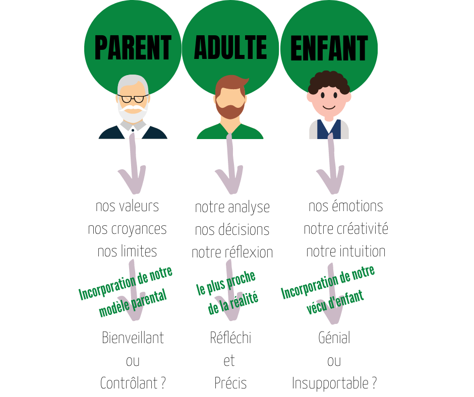

# Les softs skills 

## Des compétences pour savoir-faire et savoir-être

Si les matières liées au développement du numérique seront nécessaires pour s’insérer dans la vie active, d’autres compétences du XXIème siècle relevant (notamment) des **softs skills** seront incontournables.

Le savoir-faire sera aussi apprécié sur le marché du travail que le savoir-être. Travailler en autonomie, cocréer, savoir faire preuve d’empathie, gérer son temps et son stress fait partie des [10 softs skills déjà utiles aux élèves](https://edu.madmagz.news/2020/10/13/top-10-des-soft-skills-utiles-aux-eleves/){target=_blank}. Si elles sont pratiques pour les aider à évoluer aujourd’hui en classe, elles seront également essentielles pour vivre dans les années à venir.

## Eléments d'analyse transactionnelle

<iframe width="560" height="315" src="https://www.youtube-nocookie.com/embed/RxEhu8hWmXI" title="YouTube video player" frameborder="0" allow="accelerometer; autoplay; clipboard-write; encrypted-media; gyroscope; picture-in-picture" allowfullscreen></iframe>

{.center width=60%}

